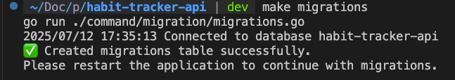
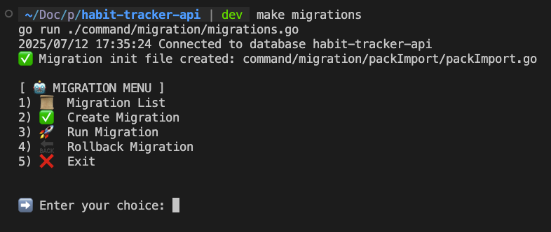
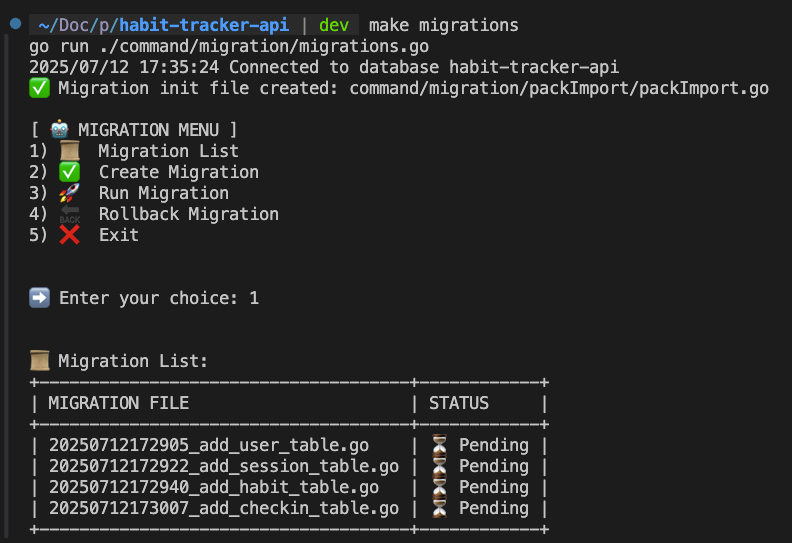
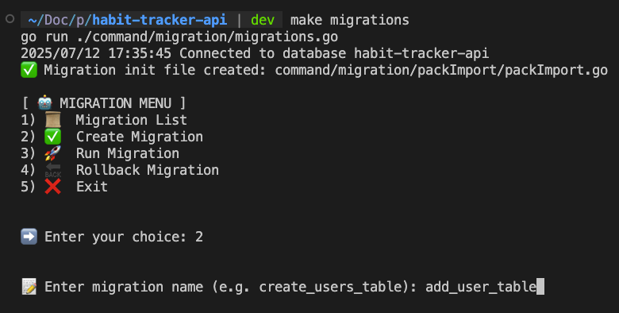
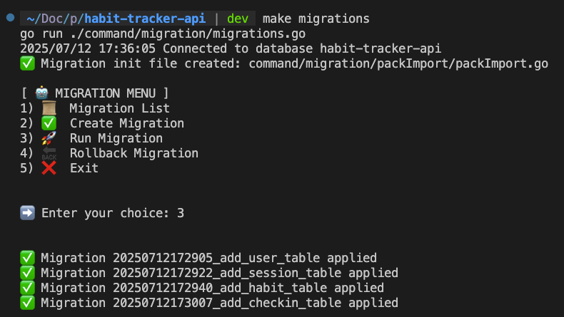
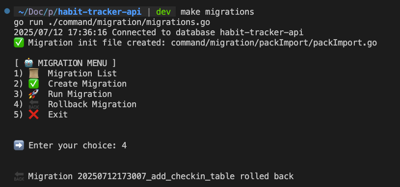

# 🧠 Habit Tracker API

A RESTful API to track daily habits and check-ins.  
Built with Go using the Echo framework, PostgreSQL, GORM, and JWT for authentication.

---

## 🚀 Features

- JWT Authentication (Register/Login/Logout)
- Habit CRUD operations
- Daily check-in tracking
- View check-in history with pagination
- Summary of check-ins grouped by habit
- Clean architecture (pkg / {module} / Controller / Service / Repository)

---

## 🏃‍♂️‍➡️ Migration

- First time excu "make migration" create table migrations and excu again



- enter chose "1" show list migration and status


- enter chose "2" for create file migration with function "up" for migration and "down" for rollback step


- enter chose "3" for migration file status is "⏳ Pending"


- enter chose "4" for bollback migration 1 setp status is "✅ Applied"


---

## ⚙️ Tech Stack

| Technology     | Purpose                         |
|----------------|----------------------------------|
| Go 1.21+       | Core programming language        |
| Echo           | Lightweight HTTP framework       |
| GORM           | ORM for PostgreSQL               |
| PostgreSQL     | Primary database                 |
| JWT            | Authentication mechanism         |
| YAML Config    | Application configuration        |

---

## 📦 Getting Started

### 1. Clone the repository

```bash
git clone https://github.com/jaayroots/habit-tracker-api.git
cd habit-tracker-api
```
### 2. Create config.yaml
```bash
cp config/config.example.yaml config/config.yaml
```
Please recheck config.yaml Database connection and generate new jwtsecret

### 3. Create PostgreSQL Database

```bash
CREATE DATABASE habit_tracker;
```

### 4. Install dependencies
```bash
go mod tidy
```

### 5. Migration database
```bash
go run ./database/migrations/migration.go
```

### After go run please add docs postman endpoint
```bash
docs/Habit Tracker api.postman_collection.json
```


